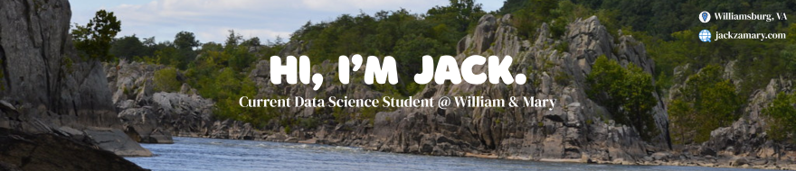

## Hi There! 🧗‍♂️
I'm Jack, a __Data Science__ major and __Biology__ minor 
- Currently, I'm an undergraduate research analyst for the Wildlife Conservation Society
- I specialize in building out machine learning pipelines and working with remote sensing data to better inform conservation-related decisions

## Github Stats 

<!-- Because my stats suck (C)
 
-->

## Socials

 &nbsp;
 &nbsp;
 &nbsp;
 &nbsp;

<!--

OLD README

# 🧗‍♂️ Jack Zamary

**` Student at William & Mary (Data Science / Geospatial Analysis / Biology)`**

Hey! I’m a Data Science student at William & Mary with a concentration in Spatial Data Analytics and a minor in Biology. I have a passion for applying geospatial tools to environmental challenges. I'm currently working on a project with the Institute for Integrative Conservation and the Wildlife Conservation Society to map ecological metrics in coastal alaskan lagoons. Outside of research and class, I enjoy cycling, running, and exploring the outdoors!

  
  
  

**jlzamary/jlzamary** is a ✨ _special_ ✨ repository because its `README.md` (this file) appears on your GitHub profile.

Here are some ideas to get you started:

- 🔭 I’m currently working on ...
- 🌱 I’m currently learning ...
- 👯 I’m looking to collaborate on ...
- 🤔 I’m looking for help with ...
- 💬 Ask me about ...
- 📫 How to reach me: ...
- 😄 Pronouns: ...
- ⚡ Fun fact: ...
-->
